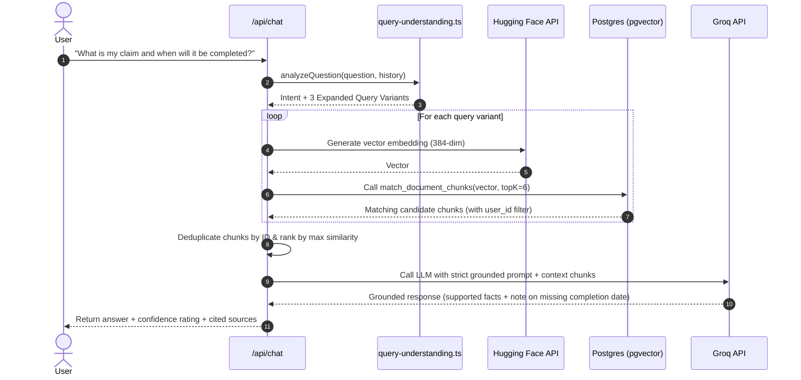

# 🧠 Claims Copilot

> An intelligent, grounded insurance assistant that transforms dense policies, claims, and damage estimates into precise, verifiable answers backed by exact source citations.

[Features](#-core-features) • [RAG Pipeline](#-how-the-rag-pipeline-works) • [Architecture](#-architecture) • [Getting Started](#-getting-started) • [Deep Dive Docs](docs/README.md)

---

## ✨ What It Does

Claims Copilot provides a unified, conversational workspace for policyholders and claims reviewers:

1. **Sign In & Authenticate** — Secure user sessions managed via Supabase Auth.
2. **Upload Documents** — Ingest insurance policies, claim forms, damage estimates, and receipts (PDFs and PNG/JPEG images).
3. **Automated Extraction & Indexing** — Extracts raw text via `unpdf` or `tesseract.js` OCR, generates 384-dimensional vector embeddings, and stores chunks in Supabase `pgvector`.
4. **Ask the Copilot** — Ask natural-language questions (e.g., *"What is my claim status?"*, *"What is my deductible?"*, *"Are water damage repairs covered?"*).
5. **Grounded Answers & Citations** — Receive concise, hallucination-free answers backed by exact source document citations, page numbers, and chunk references.
6. **Structured Document Analysis** — Run automated coverage checks, exclusions audits, and discrepancy reports.
7. **Claim Milestones & Timeline** — Track key event progression and claim milestones chronologically.

---

## 💡 Why It Exists

Insurance documentation is notoriously fragmented. Critical details about coverage limits, deductible clauses, exclusions, filing deadlines, and payout calculations are typically scattered across 40-page policy schedules, handwritten claim forms, and contractor estimates.

**Claims Copilot** eliminates manual search friction. Instead of searching through pages of legal terminology, users can converse with an AI copilot whose answers are strictly grounded in their uploaded files. If a detail is missing from the document, the assistant explicitly states that it is unavailable rather than fabricating answers.

---

## ⚡ Core Features

- 📄 **Multi-Format Ingestion** — Support for digital PDF documents (`unpdf`) and image scans (`tesseract.js` OCR for PNG and JPEG).
- 🧠 **Vector Embeddings & pgvector** — 384-dimensional dense embeddings (`BAAI/bge-small-en-v1.5`) stored directly in PostgreSQL using the `pgvector` extension.
- 🔎 **Intent-Aware RAG** — Classifies user question intent (`claim_information`, `policy_coverage`, `documents_needed`, `deductible_limits`, `discrepancies`) and dynamically expands queries into multiple semantic search variants.
- 💬 **Evidence-Grounded AI Copilot** — Powered by Groq's high-speed inference engine (`openai/gpt-oss-120b`) with strict system prompts enforcing zero hallucinations and 1–3 sentence answers.
- 📌 **Traceable Citations & Confidence Ratings** — Every answer maps back to specific document chunks, filenames, page numbers, and similarity confidence scores (`high`, `medium`, `low`).
- 🧩 **Evidence-Aware Partial Answers** — When documents contain partial answers (e.g. claim number and status are found, but completion date is missing), the assistant answers what is supported and explicitly declares what is absent.
- 📊 **Interactive Analysis** — Quick analysis triggers for Coverage & Deductible Assessment, Exclusions & Limitations Check, Missing Documentation Audit, and Estimate & Discrepancy Reporting.
- 💾 **Saved Analysis History** — Persist analysis findings, review summaries, continue past sessions, and export reports as text files.
- 🧾 **Claim Timeline** — Chronological event tracking to record milestones (incident reported, estimate received, adjuster assigned, claim approved).
- 🔐 **Multi-Tenant User Isolation** — Supabase Row-Level Security (RLS) guarantees that users can only search, view, and retrieve their own uploaded files and embeddings.

---

## 📄 How the RAG Pipeline Works

```mermaid
flowchart TD
    User([User]) -->|1. Uploads File| UploadAPI["/api/documents/upload"]
    UploadAPI -->|2. Save Raw File| Storage["Supabase Storage ('documents' bucket)"]
    UploadAPI -->|3. Extract Text| Parser{"File Type?"}
    Parser -->|"PDF"| Unpdf["unpdf Text Extractor"]
    Parser -->|"PNG / JPEG"| Tesseract["tesseract.js OCR"]
    
    Unpdf & Tesseract -->|4. Split (~2000 chars, 200 overlap)| Chunks["Text Chunks"]
    Chunks -->|5. Generate Embeddings| HF["Hugging Face API (BAAI/bge-small-en-v1.5)"]
    HF -->|6. 384-dim Vectors| PG[("Supabase Postgres (pgvector)")]
    
    User -->|7. Ask Question| ChatAPI["/api/chat"]
    ChatAPI -->|8. Intent Analysis & Query Expansion| QueryEngine["Query Understanding Engine"]
    QueryEngine -->|9. Question Vectors| RPC["match_document_chunks() RPC"]
    PG --> RPC
    RPC -->|10. Top Matching Chunks| Context["Grounded Context Assembly"]
    Context -->|11. System Prompt + Context| Groq["Groq API (openai/gpt-oss-120b)"]
    Groq -->|12. Grounded Answer + Citations| User
```

---

## 🏗️ Architecture

Claims Copilot uses a full-stack Next.js architecture integrated with Supabase and specialized AI inference endpoints:

- **Frontend & UI Layer**: Next.js 16 (App Router) with React 19, Tailwind CSS v4, and React Context (`AppContext`). Neo-brutalist interface designed for speed and clarity.
- **Server API Routes**: Next.js Serverless Route Handlers managing document processing (`/api/documents/upload`), document management (`/api/documents`), chat execution (`/api/chat`), and analysis sessions (`/api/analysis-sessions`).
- **Database & Persistence**: Supabase PostgreSQL with `pgvector` storing tables: `documents`, `document_chunks`, and `analysis_sessions`.
- **Authentication**: Supabase Auth utilizing SSR session middleware (`src/proxy.ts`).
- **Storage**: Supabase Storage (`documents` bucket) partitioned securely by user ID (`{userId}/{uuid}-{filename}`).
- **Embedding Generation**: Hugging Face Inference API running `BAAI/bge-small-en-v1.5` with exponential backoff retries.
- **LLM Inference**: Groq Cloud API running `openai/gpt-oss-120b` (temperature `0.1`) for grounded text synthesis.

---

## 🔄 Data Flow

When a user uploads a document:

1. **Validation**: Server enforces file size limits (≤10 MB) and MIME types (`application/pdf`, `image/png`, `image/jpeg`).
2. **Storage**: The file buffer is uploaded to the Supabase Storage `documents` bucket under a user-isolated path (`{user_id}/{uuid}-{filename}`).
3. **Database Insertion**: A new row is inserted into the `documents` table with `ocr_status = 'processing'`.
4. **Text Extraction**: Text is parsed using `unpdf` for digital PDFs or `tesseract.js` for image files.
5. **Chunking**: Text is segmented into chunks of ~2,000 characters with 200-character overlap.
6. **Embedding Generation**: Each chunk is embedded into a 384-dimensional vector using Hugging Face's `BAAI/bge-small-en-v1.5`.
7. **Vector Storage**: Chunks and vectors are batch-inserted into the `document_chunks` table.
8. **Finalization**: Document `ocr_status` is updated to `'complete'`.

---

## 💬 Chat / RAG Flow

When a user submits a question in the AI Copilot:



---

## 🔐 Security

- **User Authentication**: Handled via Supabase Auth (`@supabase/ssr`). Protected routes verify the active session with `auth.getUser()`.
- **Row-Level Security (RLS)**: Enforced across all tables (`documents`, `document_chunks`, `analysis_sessions`). Users can only query, insert, or delete their own data.
- **Tenant Vector Isolation**: The `match_document_chunks` database function joins the `documents` table and strictly verifies `documents.user_id = auth.uid()`.
- **Server-Side Credential Protection**: Secrets (`SUPABASE_SERVICE_ROLE_KEY`, `GROQ_API_KEY`, `HUGGINGFACE_API_KEY`) are kept in server-side API routes and are never exposed to the client.

---

## 🗂️ Project Structure

```
claims-copilot/
├── docs/                        # Architectural documentation & sequence diagrams
│   └── README.md
├── scripts/                     # Verification test scripts & setup helpers
│   ├── setup.ts                 # Safe environment initialization helper
│   ├── verify-phase16.ts        # Adaptive RAG verification suite
│   ├── verify-phase15.ts        # Analysis sessions verification
│   ├── verify-phase14.ts        # Document extraction verification
│   ├── verify-phase13.ts        # UI & view verification
│   ├── verify-regression.ts     # Regression test suite
│   ├── verify-upload.ts         # Upload pipeline test
│   ├── test-e2e.ts              # End-to-end user flow test
│   └── test-rag.ts              # Supabase RPC vector test
├── src/
│   ├── app/                     # Next.js App Router (Pages & API Routes)
│   │   ├── (auth)/              # Authentication routes (/signup)
│   │   ├── api/                 # Serverless API route handlers
│   │   │   ├── analysis-sessions/
│   │   │   ├── chat/
│   │   │   ├── documents/
│   │   │   └── test-login/
│   │   ├── login/               # Sign-in page
│   │   ├── globals.css          # Tailwind CSS v4 & custom design system tokens
│   │   ├── layout.tsx           # Application root layout
│   │   └── page.tsx             # Main view router
│   ├── components/              # React UI components
│   │   ├── analysis/            # AnalysisView & Saved Analysis cards
│   │   ├── auth/                # LoginForm & SignupForm
│   │   ├── chat/                # ChatWindow, ChatMessage, SourceCard
│   │   ├── dashboard/           # DashboardView & Quick Triggers
│   │   ├── documents/           # DocumentsView & DocumentUploadModal
│   │   ├── settings/            # SettingsView & profile info
│   │   ├── sidebar/             # Sidebar navigation & conversations list
│   │   └── timeline/            # TimelineView & claim event tracking
│   ├── context/                 # State management (AppContext.tsx)
│   ├── lib/                     # Core application utilities
│   │   ├── rag/                 # RAG logic (embed.ts, retrieve.ts, query-understanding.ts)
│   │   ├── supabase/            # Supabase SSR, Client, Server, Admin clients
│   │   └── documents-store.ts   # Document management helper
│   ├── proxy.ts                 # Session middleware handler
│   └── types/                   # TypeScript interfaces & Zod validation schemas
└── supabase/
    └── migrations/              # SQL migrations (pgvector, RLS, tables, RPCs)
```

---

## 🛠️ Commands Reference

| Command | Purpose |
|---|---|
| `npm run dev` | Starts local Next.js development server at `http://localhost:3000` |
| `npm run setup` | Safe setup helper (checks environment & initializes `.env.local` if missing) |
| `npm test` | Runs the Phase 16 Adaptive RAG verification test suite |
| `npm run lint` | Runs ESLint code quality checks |
| `npx tsc --noEmit` | Validates TypeScript type safety across the project |
| `npm run build` | Compiles and builds the production Next.js bundle |

---

## 🚀 Getting Started

### Prerequisites

- **Node.js**: `v18.x` or higher
- **npm**: `v9.x` or higher
- **Supabase Project**: Active project with PostgreSQL and `pgvector` enabled
- **API Keys**: [Groq API Key](https://console.groq.com/keys) & [Hugging Face Access Token](https://huggingface.co/settings/tokens)

---

### Step-by-Step Setup Flow

1. **Clone the repository**:
   ```bash
   git clone https://github.com/sadiyasyed28/claims-copilot.git
   cd claims-copilot
   ```

2. **Install dependencies**:
   ```bash
   npm install
   ```

3. **Initialize Environment Configuration**:
   ```bash
   npm run setup
   ```
   *(Or copy `.env.example` to `.env.local` manually: `cp .env.example .env.local`)*

4. **Configure Credentials in `.env.local`**:
   ```env
   # Supabase Configuration (Client-Safe)
   NEXT_PUBLIC_SUPABASE_URL=https://your-project.supabase.co
   NEXT_PUBLIC_SUPABASE_ANON_KEY=your-supabase-anon-key

   # Supabase Service Role (Server-Only / Private)
   SUPABASE_SERVICE_ROLE_KEY=your-supabase-service-role-key

   # AI Provider API Keys (Server-Only / Private)
   HUGGINGFACE_API_KEY=your-huggingface-api-key
   GROQ_API_KEY=your-groq-api-key
   ```

5. **Apply Database Migrations**:
   Run the migration scripts in [`supabase/migrations/`](supabase/migrations) in numerical order inside your Supabase SQL Editor:
   - `20260826_create_tables.sql` (Creates `documents` & `document_chunks` with `vector(384)`)
   - `20260825_add_match_document_chunks.sql` (Creates vector search RPC function)
   - `20260826182100_create_analysis_sessions.sql` (Creates `analysis_sessions` table)

6. **Start the Development Server**:
   ```bash
   npm run dev
   ```
   Navigate to [http://localhost:3000](http://localhost:3000).

---

## 🧪 Testing & Verification

```bash
# 1. Run Adaptive RAG verification tests
npm test

# 2. Run TypeScript type check
npx tsc --noEmit

# 3. Run ESLint
npm run lint

# 4. Test production build
npm run build
```

---

## 🗄️ Database & Migrations

The database is built on PostgreSQL with Supabase:

- `documents`: Stores file metadata (`storage_path`, `original_filename`, `file_size`, `file_type`, `ocr_status`, `document_type`, `user_id`).
- `document_chunks`: Stores text chunks and their 384-dimensional vector embeddings (`vector(384)`).
- `analysis_sessions`: Stores multi-step document extraction and comparison sessions.
- `match_document_chunks(...)`: Custom PostgreSQL RPC function performing vector similarity search using cosine distance (`dc.embedding <=> query_embedding`) with ownership validation (`d.user_id = auth.uid()`).

---

## 🚢 Deployment

Claims Copilot is optimized for deployment on [Vercel](https://vercel.com) or any standard Node.js server:

1. Push your repository to GitHub.
2. Import the project into Vercel.
3. Configure the environment variables (`NEXT_PUBLIC_SUPABASE_URL`, `NEXT_PUBLIC_SUPABASE_ANON_KEY`, `SUPABASE_SERVICE_ROLE_KEY`, `GROQ_API_KEY`, `HUGGINGFACE_API_KEY`) in the Vercel Project Settings.
4. Deploy the project (`npm run build`).

---

## 🖼️ Screenshots / Demo

*(Screenshots will be added here as UI demo captures are recorded)*

---

## 🧠 Design Philosophy

> **Less dashboard spaghetti. More answers.**

- **Grounded Truth over Hallucination**: AI answers are strictly bounded by retrieved context. If evidence is absent, the system explicitly declares it.
- **Traceable Intelligence**: Every fact is backed by a clickable source chunk reference.
- **Neo-Brutalist Clarity**: High-contrast, bold borders, and purposeful typography designed for fast visual comprehension.
- **User-Isolated Privacy**: Multi-tenant database security at the PostgreSQL layer.

---

## 🤝 Contributing

1. Fork the repository and create a feature branch: `git checkout -b feature/your-feature-name`.
2. Ensure no sensitive keys or `.env` files are committed.
3. Run `npm test`, `npm run lint`, and `npx tsc --noEmit` before opening a Pull Request.

---

## 📜 License

No explicit license is currently specified for this repository. All rights reserved.
